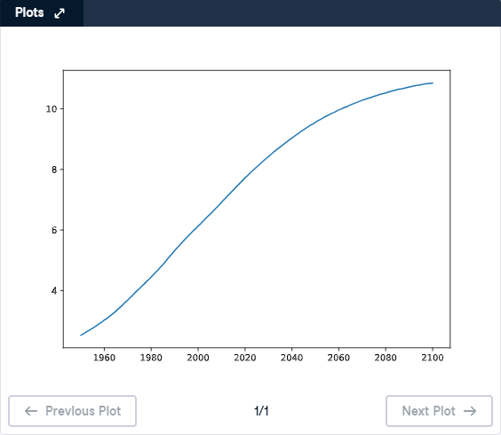

# 📈 Line Plot (1) - Matplotlib

## 🎯 Exercise Description

With **Matplotlib**, you can create different types of plots in Python.

The most basic type of plot is the:

```
Line Plot
```

A line plot is useful for showing **trends and changes over time**.

---

# 📌 General Recipe for Creating a Line Plot

The basic structure is:

```python
import matplotlib.pyplot as plt

plt.plot(x, y)

plt.show()
```

Where:

| Component | Description |
|---|---|
| `x` | Data displayed on the horizontal axis |
| `y` | Data displayed on the vertical axis |
| `plt.plot()` | Creates the line plot |
| `plt.show()` | Displays the visualization |

---

# 🌍 World Population Example

In the previous lesson, you saw how the world population changed over time.

The World Bank provides estimated population data from:

```
1950 to 2100
```

The data is stored in two lists:

```python
year
```

Contains the years.

```python
pop
```

Contains the corresponding population values.

Example:

```python
year = [1950, 1951, ..., 2100]

pop = [2.5, 2.6, ..., predicted_population]
```

---

# 🎯 Instructions

Complete the following tasks:

1. Print the last item from the `year` list.
2. Print the last item from the `pop` list.
3. Import `matplotlib.pyplot` as `plt`.
4. Create a line plot:
   - `year` should be mapped on the horizontal axis (X-axis).
   - `pop` should be mapped on the vertical axis (Y-axis).
5. Display the plot using `plt.show()`.

---

# 💡 Solution

```python
# Print the last item from year and pop
print(year[-1])
print(pop[-1])

# Import matplotlib.pyplot as plt
import matplotlib.pyplot as plt 

# Make a line plot: year on the x-axis, pop on the y-axis
plt.plot(year, pop)

# Display the plot with plt.show()
plt.show()
```

---

# 📊 Line Plot Output

The generated line plot shows the predicted growth of the world population from **1950 to 2100**.



---

# 📚 Explanation

## 1️⃣ Accessing the Last Element of a List

Python uses negative indexing to access elements from the end of a list.

Example:

```python
year[-1]
```

returns the last year in the list.

```python
pop[-1]
```

returns the population value corresponding to that year.

---

## 2️⃣ Importing Matplotlib

```python
import matplotlib.pyplot as plt
```

This imports the plotting tools from Matplotlib.

The alias:

```python
plt
```

is commonly used because it makes plotting commands shorter.

---

## 3️⃣ Creating the Line Plot

```python
plt.plot(year, pop)
```

This creates a line graph where:

- X-axis → `year`
- Y-axis → `pop`

Matplotlib automatically connects the data points with lines.

---

## 4️⃣ Displaying the Plot

```python
plt.show()
```

This command renders and displays the visualization.

Without `plt.show()`, the plot may not appear.

---

# 📝 Key Takeaways

✅ `plt.plot(x, y)` creates a line plot  
✅ The first argument represents the X-axis  
✅ The second argument represents the Y-axis  
✅ `plt.show()` displays the chart  
✅ Negative indexing (`-1`) retrieves the last list element  
✅ Line plots are useful for showing trends over time 📊

---

# 🚀 Practice Goal

Use line plots to visualize how values change over time and identify patterns hidden inside datasets! 📈
```
