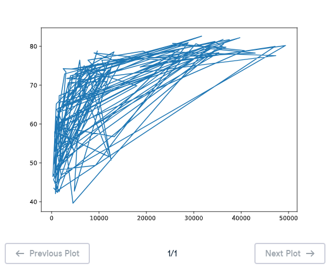

# 📈 Line Plot (3) - Matplotlib

## 🎯 Exercise Description

Now that you have built your first line plot, you will start working with the data used by **Professor Hans Rosling** to create his famous bubble chart.

The dataset was collected in:

```
2007
```

The goal is to explore the relationship between:

- 🌍 **Life expectancy**
- 💰 **GDP per capita**

---

# 📊 Dataset Description

Two lists are available:

## 🧬 `life_exp`

Contains the **life expectancy** values for each country.

Example:

```python
life_exp = [43.8, 76.5, 81.2, ...]
```

---

## 💵 `gdp_cap`

Contains the **GDP per capita** values for each country.

GDP per capita represents:

```
GDP ÷ Population
```

GDP stands for:

```
Gross Domestic Product
```

It represents the total economic value produced by a country.

---

# 📌 Matplotlib Setup

`matplotlib.pyplot` is already imported as:

```python
import matplotlib.pyplot as plt
```

You can start creating your visualization immediately.

---

# 🎯 Instructions

Complete the following tasks:

1. Print the last item from:
   - `gdp_cap`
   - `life_exp`

   These values represent information about **Zimbabwe**.

2. Create a line chart:
   - `gdp_cap` should be on the X-axis.
   - `life_exp` should be on the Y-axis.

3. Display the plot using:

```python
plt.show()
```

4. Analyze whether a line plot is the best visualization method for this type of data.

---

# 💡 Solution

```python
# Print the last item of gdp_cap and life_exp
print(gdp_cap[-1])
print(life_exp[-1])

# Make a line plot, gdp_cap on the x-axis, life_exp on the y-axis
plt.plot(gdp_cap, life_exp)

# Display the plot
plt.show()
```

---

# 📊 Line Plot Output

The generated line plot shows the relationship between **GDP per capita** and **life expectancy** across countries.



---

# 📚 Explanation

## 1️⃣ Accessing Zimbabwe's Data

Python uses negative indexing to access elements from the end of a list.

Example:

```python
gdp_cap[-1]
```

Returns the last GDP per capita value.

```python
life_exp[-1]
```

Returns the last life expectancy value.

Since the dataset is ordered by country, the final item represents Zimbabwe.

---

## 2️⃣ Creating the Line Plot

```python
plt.plot(gdp_cap, life_exp)
```

This creates a line chart where:

- X-axis → GDP per capita
- Y-axis → Life expectancy

Matplotlib connects each country with a line.

---

## 3️⃣ Is a Line Plot Suitable?

A line plot is not the best choice for this dataset.

Why?

A line plot is mainly used when:

- 📅 Data has a natural order
- ⏳ Values change continuously over time
- 🔗 Connecting points makes sense

Countries do not have a natural sequence, so connecting them with lines may create misleading patterns.

A better visualization would be:

```python
Scatter Plot
```

because it shows individual countries and the relationship between GDP and life expectancy more clearly.

---

# 📝 Key Takeaways

✅ `gdp_cap[-1]` retrieves the last GDP value  
✅ `life_exp[-1]` retrieves the last life expectancy value  
✅ `plt.plot(x, y)` creates a line chart  
✅ Line plots are useful for ordered data  
✅ Scatter plots are better for comparing relationships between independent observations 🌍📊

---

# 🚀 Practice Goal

Use appropriate visualizations depending on the structure and meaning of your data. Choosing the right chart helps communicate insights more effectively! 📈
