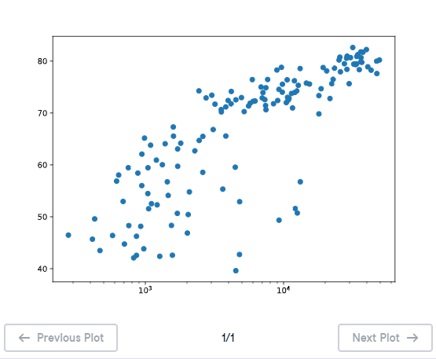

# 🔵 Scatter Plot (1) - Matplotlib

## 🎯 Exercise Description

When you have a **time scale** along the horizontal axis, a **line plot** is usually the best choice.

However, when you want to examine the relationship or correlation between two variables, a **scatter plot** is often a better visualization method.

A scatter plot displays individual observations as points, making patterns and relationships easier to identify.

---

# 📌 General Recipe for Creating a Scatter Plot

The basic structure is:

```python
import matplotlib.pyplot as plt

plt.scatter(x, y)

plt.show()
```

Where:

| Component | Description |
|---|---|
| `x` | Data displayed on the horizontal axis |
| `y` | Data displayed on the vertical axis |
| `plt.scatter()` | Creates the scatter plot |
| `plt.show()` | Displays the visualization |

---

# 🌍 GDP per Capita vs Life Expectancy Example

The dataset contains information collected in:

```
2007
```

for different countries.

The variables are:

---

## 💰 GDP per Capita (`gdp_cap`)

Represents the economic output per person in a country.

Formula:

```
GDP per capita = GDP ÷ Population
```

Higher values generally indicate a stronger economy.

---

## 🧬 Life Expectancy (`life_exp`)

Contains the average expected lifespan of people in each country.

---

# 🎯 Instructions

Complete the following tasks:

1. Change the existing line plot into a scatter plot.
2. Display:
   - `gdp_cap` on the X-axis.
   - `life_exp` on the Y-axis.
3. Change the X-axis to a logarithmic scale using:

```python
plt.xscale('log')
```

4. Display the plot using:

```python
plt.show()
```

---

# 💡 Solution

```python
# Change the line plot below to a scatter plot
plt.scatter(gdp_cap, life_exp)

# Put the x-axis on a logarithmic scale
plt.xscale('log')

# Show plot
plt.show()
```

---

# 📊 Scatter Plot Output

The scatter plot shows the relationship between **GDP per capita** and **life expectancy** among different countries.



---

# 📚 Explanation

## 1️⃣ Creating a Scatter Plot

```python
plt.scatter(gdp_cap, life_exp)
```

This creates a scatter plot where:

- X-axis → GDP per capita
- Y-axis → Life expectancy

Each point represents one country.

---

## 2️⃣ Using a Logarithmic Scale

```python
plt.xscale('log')
```

GDP per capita values can vary greatly between countries.

Some countries have:

```
Low GDP per capita
```

while others have:

```
Extremely high GDP per capita
```

A logarithmic scale compresses large values and makes patterns easier to see.

---

## 3️⃣ Why Scatter Plot is Better

A scatter plot is more appropriate because:

- 🌍 Each country is an independent observation.
- 🔗 Countries do not have a natural order.
- 📈 It shows correlation between two variables.

The visualization reveals that countries with higher GDP per capita generally have higher life expectancy.

---

# 📝 Key Takeaways

✅ `plt.scatter(x, y)` creates a scatter plot  
✅ Scatter plots show relationships between variables  
✅ Each point represents an observation  
✅ Logarithmic scales help visualize widely distributed data  
✅ GDP per capita and life expectancy have a positive relationship 🌍📈

---

# 🚀 Practice Goal

Choose the correct visualization based on your data:

📈 Line Plot → Trends over time  
🔵 Scatter Plot → Relationships and correlations  

The right chart helps reveal meaningful insights from data! 📊
