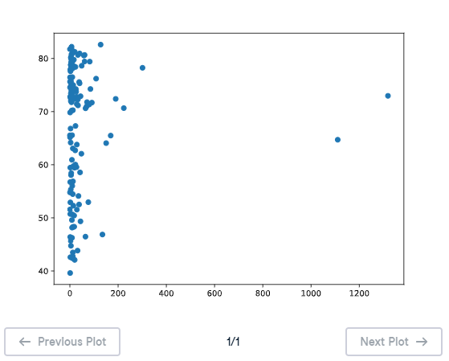

# 📊 Scatter Plot (2) - Matplotlib

## 🎯 Exercise Description

In the previous exercise, you discovered that:

```
Higher GDP per capita → Higher life expectancy
```

This means that GDP per capita and life expectancy have a **positive correlation**.

Now, we will investigate another possible relationship:

```
Population vs Life Expectancy
```

The question:

> Does the population size of a country have a relationship with its life expectancy?

---

# 📌 Scatter Plot Concept

A **scatter plot** is commonly used to identify relationships or correlations between two variables.

General structure:

```python
import matplotlib.pyplot as plt

plt.scatter(x, y)

plt.show()
```

Where:

| Component | Description |
|---|---|
| `x` | Data shown on the horizontal axis |
| `y` | Data shown on the vertical axis |
| `plt.scatter()` | Creates the scatter plot |
| `plt.show()` | Displays the visualization |

---

# 🌍 Dataset Information

The dataset contains information from countries in:

```
2007
```

Two lists are available:

---

## 👥 Population Data (`pop`)

The variable:

```python
pop
```

contains the population of each country.

Unit:

```
Millions of people
```

Example:

```python
pop = [31.8, 3.5, 44.2, ...]
```

---

## ❤️ Life Expectancy Data (`life_exp`)

The variable:

```python
life_exp
```

contains the average life expectancy of each country.

Unit:

```
Years
```

Example:

```python
life_exp = [43.8, 76.4, 72.3, ...]
```

---

# 🎯 Instructions

Complete the following tasks:

1. Import `matplotlib.pyplot` as `plt`.
2. Create a scatter plot:
   - `pop` should be mapped on the horizontal axis (X-axis).
   - `life_exp` should be mapped on the vertical axis (Y-axis).
3. Display the plot using:

```python
plt.show()
```

4. Analyze the chart and determine if there is a correlation between population size and life expectancy.

---

# 💡 Solution

```python
# Import package
import matplotlib.pyplot as plt

# Build Scatter plot
plt.scatter(pop, life_exp)

# Show plot
plt.show()
```

---

# 📚 Explanation

## 1️⃣ Importing Matplotlib

```python
import matplotlib.pyplot as plt
```

This imports the plotting functionality from the Matplotlib library.

The alias:

```python
plt
```

is the standard shortcut used for plotting commands.

---

## 2️⃣ Creating the Scatter Plot

```python
plt.scatter(pop, life_exp)
```

This creates a scatter plot where:

```
X-axis → Population (millions)
Y-axis → Life expectancy (years)
```

Each point represents one country.

---

## 3️⃣ Displaying the Visualization

```python
plt.show()
```

This renders the plot and displays the chart.

Without this command, the visualization may not appear.

---

# 📈 Plot Output

The generated scatter plot is saved as:

```
M01_Image_04
```



---

# 🔎 Interpretation

The scatter plot helps determine whether population size affects life expectancy.

Possible observations:

- Countries with larger populations do not always have higher life expectancy.
- Population size alone does not show a strong direct relationship with life expectancy.
- Other factors such as healthcare, economy, education, and living conditions may have a larger impact.

---

# 📝 Key Takeaways

✅ Scatter plots are useful for finding relationships between variables.  
✅ `plt.scatter(x, y)` creates a scatter plot.  
✅ The first argument represents the X-axis.  
✅ The second argument represents the Y-axis.  
✅ Population and life expectancy do not show a simple direct correlation.  
✅ Visualizations help reveal patterns that are difficult to see from raw data. 📊

---

# 🚀 Practice Goal

Use scatter plots to explore relationships between different variables and discover hidden patterns inside datasets! 🔍📈
