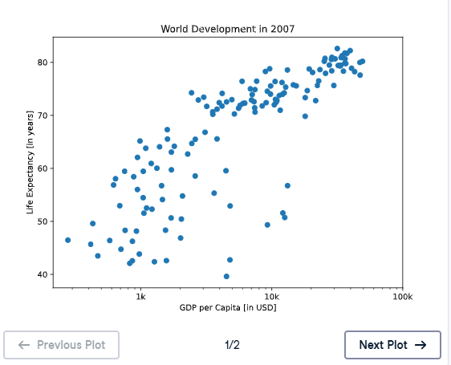
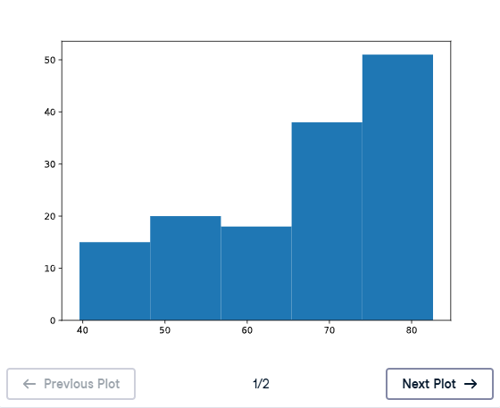
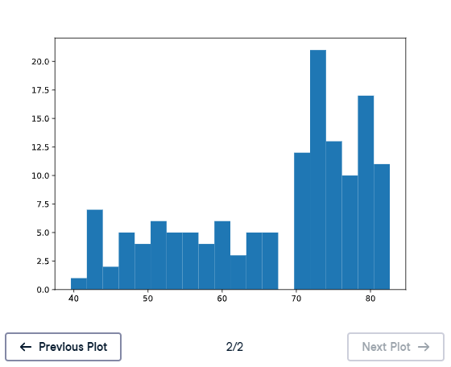

# 📊 Build a Histogram (2): Bins - Matplotlib

## 🎯 Exercise Description

In the previous exercise, you created a histogram without specifying the number of bins.

When the `bins` argument is not provided, Matplotlib automatically uses:

```
10 bins
```

However, choosing the correct number of bins is important because it affects how we interpret the data.

---

# 📌 Understanding Bins

A **bin** is a range of values grouped together in a histogram.

Example:

```python
plt.hist(data, bins=5)
```

means:

```
Divide the data into 5 groups
```

---

# ⚖️ Choosing the Right Number of Bins

The number of bins affects the level of detail shown.

## Too Few Bins ❌

Example:

```python
plt.hist(life_exp, bins=5)
```

Possible problem:

- Data becomes oversimplified.
- Important patterns may disappear.
- Different groups may be combined together.

---

## Too Many Bins ❌

Example:

```python
plt.hist(life_exp, bins=20)
```

Possible problem:

- The chart becomes too detailed.
- Random variations may appear as patterns.
- The bigger picture may become harder to see.

---

# 🌍 Dataset Information

The dataset:

```python
life_exp
```

contains:

```
Life expectancy values for countries in 2007
```

The goal is to compare different histogram resolutions:

1. Histogram with 5 bins
2. Histogram with 20 bins

---

# 🐍 Histogram Syntax

The structure is:

```python
plt.hist(data, bins)

plt.show()
```

Example:

```python
plt.hist(life_exp, 5)
```

creates a histogram with:

```
5 bins
```

---

# 🎯 Instructions

Complete the following tasks:

## 1️⃣ Create a histogram with 5 bins

Use:

```python
plt.hist(life_exp, 5)
```

Then display it.

---

## 2️⃣ Clear the current plot

Use:

```python
plt.clf()
```

This removes the current figure so a new plot can be created.

---

## 3️⃣ Create another histogram with 20 bins

Use:

```python
plt.hist(life_exp, 20)
```

Then display it.

---

# 💡 Solution

```python
# Build histogram with 5 bins
plt.hist(life_exp, 5)

# Show and clean up plot
plt.show()
plt.clf()

# Build histogram with 20 bins
plt.hist(life_exp, 20)

# Show and clean up again
plt.show()
plt.clf()
```

---

### Before



---

# 📚 Explanation

## 1️⃣ Histogram with 5 Bins

```python
plt.hist(life_exp, 5)
```

This divides life expectancy values into:

```
5 groups
```

Advantages:

✅ Easier to see the overall trend

Disadvantages:

❌ Less detail about the distribution

---

## 2️⃣ Clearing the Plot

```python
plt.clf()
```

`clf` means:

```
Clear Figure
```

It removes the current plot so another visualization can be created.

---

## 3️⃣ Histogram with 20 Bins

```python
plt.hist(life_exp, 20)
```

This creates:

```
20 smaller groups
```

Advantages:

✅ Shows more details

Disadvantages:

❌ May show unnecessary variations

---

# 📈 Plot Outputs

## Histogram with 5 Bins

Saved as:

```
M02_Image_02.1
```




---

## Histogram with 20 Bins

Saved as:

```
M02_Image_02.2
```



---

# 🔎 Comparison

## 5 Bins

Shows the general distribution:

- Easier to understand
- Good for seeing the big picture
- May hide smaller patterns

---

## 20 Bins

Shows more details:

- More precise distribution
- Reveals smaller differences
- May appear noisy

---

# 📝 Key Takeaways

✅ The `bins` argument controls histogram detail.  
✅ Fewer bins simplify the data.  
✅ More bins reveal more details.  
✅ The best number of bins depends on the dataset.  
✅ `plt.clf()` clears the current visualization.  
✅ Histograms help identify patterns and distributions. 📊

---

# 🚀 Practice Goal

Experiment with different bin sizes to find the best visualization that balances:

```
Detail 🔍
+
Clarity 📊
```

A good histogram tells the story of your data effectively! 📈
