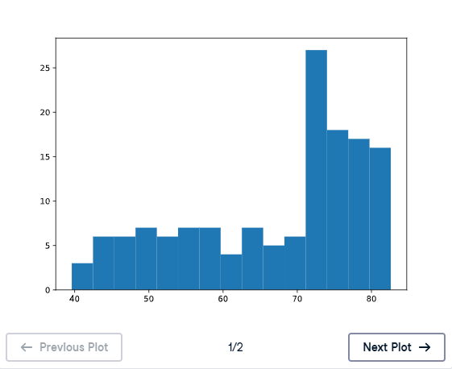
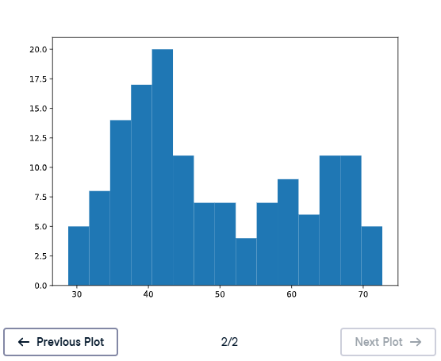

# 📊 Build a Histogram (3): Compare - Matplotlib

## 🎯 Exercise Description

Histograms are not only useful for exploring a single dataset. They are also powerful tools for **comparing distributions** between different groups or time periods.

In the previous lesson, you saw how population pyramids could compare:

```
Present Population Distribution
vs
Future Population Distribution
```

Because histograms show how values are distributed, they make comparisons easier.

---

# 🌍 Dataset Comparison

In this exercise, we will compare:

## 📅 Life Expectancy in 2007

Dataset:

```python
life_exp
```

Contains:

```
Life expectancy values for different countries in 2007
```

---

## 📅 Life Expectancy in 1950

Dataset:

```python
life_exp1950
```

Contains:

```
Life expectancy values for different countries in 1950
```

---

# 🎯 Objective

Create two histograms:

1. Life expectancy distribution in **2007**
2. Life expectancy distribution in **1950**

Both histograms should use:

```
15 bins
```

This allows us to compare how global life expectancy changed over time.

---

# 📌 Histogram Syntax

The structure:

```python
plt.hist(data, bins)

plt.show()
```

Example:

```python
plt.hist(life_exp, 15)
```

creates a histogram with:

```
15 bins
```

---

# 🐍 Matplotlib Functions Used

## Create Histogram

```python
plt.hist()
```

Creates the histogram visualization.

---

## Display Plot

```python
plt.show()
```

Displays the generated chart.

---

## Clear Plot

```python
plt.clf()
```

Clears the current figure so another histogram can be created.

---

# 🎯 Instructions

Complete the following tasks:

## 1️⃣ Histogram for 2007 Data

Create a histogram using:

```python
life_exp
```

with:

```
15 bins
```

---

## 2️⃣ Display and Clear the Plot

Use:

```python
plt.show()
plt.clf()
```

---

## 3️⃣ Histogram for 1950 Data

Create another histogram using:

```python
life_exp1950
```

with:

```
15 bins
```

---

## 4️⃣ Display and Clear Again

Use:

```python
plt.show()
plt.clf()
```

---

# 💡 Solution

```python
# Histogram of life_exp, 15 bins
plt.hist(life_exp, 15)

# Show and clear plot
plt.show()
plt.clf()

# Histogram of life_exp1950, 15 bins
plt.hist(life_exp1950, 15)

# Show and clear plot again
plt.show()
plt.clf()
```

---

# 📚 Explanation

## 1️⃣ Histogram for 2007

```python
plt.hist(life_exp, 15)
```

Creates a histogram showing:

```
Global life expectancy distribution in 2007
```

Using 15 bins provides enough detail while still showing the overall pattern.

---

## 2️⃣ Histogram for 1950

```python
plt.hist(life_exp1950, 15)
```

Creates a histogram showing:

```
Global life expectancy distribution in 1950
```

The same number of bins makes comparison easier.

---

# 📈 Plot Outputs

## 🌍 Life Expectancy Distribution - 2007

Saved as:

```
M02_Image_03.1
```



---

## 🌍 Life Expectancy Distribution - 1950

Saved as:

```
M02_Image_03.2
```



---

# 🔎 Interpretation

Comparing the two histograms shows how life expectancy changed over time.

Expected observations:

## 1950

- More countries had lower life expectancy.
- The distribution is shifted toward smaller values.

## 2007

- More countries achieved higher life expectancy.
- The distribution moved toward larger values.

This indicates a major improvement in global health over several decades.

---

# 📝 Key Takeaways

✅ Histograms are useful for comparing distributions.  
✅ Using the same number of bins makes comparisons easier.  
✅ `plt.clf()` clears the current chart.  
✅ Historical comparisons can reveal long-term trends.  
✅ Global life expectancy increased significantly from 1950 to 2007. 🌍📈

---

# 🚀 Practice Goal

Use histograms to compare datasets across:

- Different years 📅
- Different groups 👥
- Different categories 📊

Comparing distributions helps reveal important changes hidden inside data! 🔍
