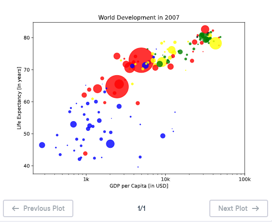

# 🎨 Colors - Customizing Scatter Plot Appearance

## 🎯 Exercise Description

A good visualization does not only display data; it also helps viewers understand patterns quickly. 📊

In this exercise, you will improve the world development scatter plot by adding:

- 🎨 Different colors for countries
- 🔍 Transparency control using alpha

The scatter plot will now display:

- 💰 GDP per capita on the X-axis
- ❤️ Life expectancy on the Y-axis
- 👥 Population using bubble size
- 🌍 Continent using bubble color

---

# 🎨 Adding Colors to Scatter Plots

In Matplotlib, colors can be controlled using the:

```python
c
```

argument inside:

```python
plt.scatter()
```

Example:

```python
plt.scatter(
    gdp_cap,
    life_exp,
    c=col
)
```

The `c` argument assigns a color to each data point.

---

# 🌍 Color Mapping by Continent

The colors were created based on the continent of each country.

Example mapping:

```python
{
    'Asia': 'red',
    'Europe': 'green',
    'Africa': 'blue',
    'Americas': 'yellow',
    'Oceania': 'black'
}
```

Each country receives a color depending on its continent.

This allows the visualization to show geographical patterns.

---

# 🔍 Adjusting Transparency with Alpha

The transparency of scatter points can be controlled using:

```python
alpha
```

Example:

```python
alpha=0.8
```

The value range is:

| Alpha Value | Meaning |
|---|---|
| `0` | Completely transparent |
| `0.5` | Semi-transparent |
| `1` | Completely visible |

Using:

```python
alpha=0.8
```

makes bubbles slightly transparent, allowing overlapping points to remain visible.

---

# 💻 Solution

```python
# Specify c and alpha inside plt.scatter()

plt.scatter(
    x=gdp_cap,
    y=life_exp,
    s=np.array(pop) * 2,
    c=col,
    alpha=0.8
)

# Previous customizations

plt.xscale('log')

plt.xlabel('GDP per Capita [in USD]')

plt.ylabel('Life Expectancy [in years]')

plt.title('World Development in 2007')

plt.xticks(
    [1000, 10000, 100000],
    ['1k', '10k', '100k']
)

# Show the plot

plt.show()
```
---

## 📊 Graph Output



---

# 📚 Explanation

## 1️⃣ Adding Colors

```python
c=col
```

Assigns colors to each country.

Each point receives a color based on its continent.

Example:

```
Asia      → Red
Europe    → Green
Africa    → Blue
Americas  → Yellow
Oceania   → Black
```

---

## 2️⃣ Setting Bubble Transparency

```python
alpha=0.8
```

Controls how transparent the bubbles appear.

A value of `0.8` means:

- Mostly visible
- Slightly transparent
- Easier to see overlapping bubbles

---

## 3️⃣ Combining Previous Customizations

The scatter plot now includes:

### Position

```python
x=gdp_cap
y=life_exp
```

### Size

```python
s=np.array(pop) * 2
```

### Color

```python
c=col
```

### Transparency

```python
alpha=0.8
```

---

# 📊 Expected Output

The final visualization contains:

✅ GDP per capita on logarithmic scale 📈  
✅ Life expectancy comparison ❤️  
✅ Population represented by bubble size 👥  
✅ Continents represented by colors 🌍  
✅ Improved readability using transparency 🔍  

Image reference:

```
M03_Image_04
```

---

# 📚 Key Takeaways

✅ `c` controls scatter plot colors  
✅ `alpha` controls transparency  
✅ Bubble charts can display multiple variables at once  
✅ Colors can reveal groups and categories  
✅ Transparency helps when data points overlap  

---

# 🚀 Practice Goal

Use:

- 🎨 Colors to represent categories
- 🔵 Sizes to represent magnitude
- 🔍 Transparency to improve readability

A well-customized scatter plot can tell a powerful data story! 🌎📈
