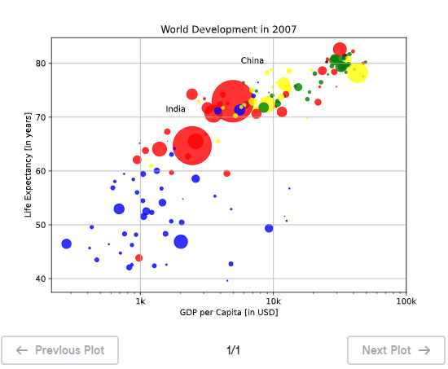

# 🎨 Additional Customizations - Matplotlib Scatter Plot

---

## 🎯 Exercise Description

If you have another look at the script, under **Additional Customizations**, you'll see that there are two `plt.text()` functions.

These functions add labels to the scatter plot:

- 🇮🇳 `"India"`
- 🇨🇳 `"China"`

The final improvement is adding **gridlines** to make the visualization easier to read.

---

# 📌 Adding Gridlines

Matplotlib provides the `plt.grid()` function to display gridlines on a plot.

Syntax:

```python
plt.grid(True)
```

When enabled:

✅ Horizontal gridlines appear  
✅ Vertical gridlines appear  
✅ Data points become easier to compare  
✅ The visualization becomes clearer  

---

# 🎯 Instructions

Complete the following task:

1. Use the existing scatter plot code.
2. Add text labels for:
   - India
   - China
3. Add gridlines using:

```python
plt.grid(True)
```

4. Display the final plot using:

```python
plt.show()
```

---

# 💡 Solution

```python
# Scatter plot
plt.scatter(x = gdp_cap, y = life_exp, s = np.array(pop) * 2, c = col, alpha = 0.8)

# Previous customizations
plt.xscale('log')

plt.xlabel('GDP per Capita [in USD]')
plt.ylabel('Life Expectancy [in years]')

plt.title('World Development in 2007')

plt.xticks(
    [1000,10000,100000],
    ['1k','10k','100k']
)

# Additional customizations
plt.text(1550, 71, 'India')
plt.text(5700, 80, 'China')

# Add gridlines
plt.grid(True)

# Show the plot
plt.show()
```

---

## 📊 Graph Output



---

# 📚 Explanation

## 1️⃣ Adding Text Labels

The `plt.text()` function adds text annotations inside the plot.

Example:

```python
plt.text(1550, 71, 'India')
```

This places the text:

- X-position → `1550`
- Y-position → `71`
- Label → `India`

Another example:

```python
plt.text(5700, 80, 'China')
```

adds the label `"China"` to the graph.

---

## 2️⃣ Adding Gridlines

```python
plt.grid(True)
```

The grid helps users:

- 📈 Compare values more easily
- 🔎 Estimate positions of points
- 🌍 Understand relationships between variables

---

# 📝 Key Takeaways

✅ `plt.text()` adds annotations to visualizations  
✅ `plt.grid(True)` adds gridlines to improve readability  
✅ Customizations must be added before `plt.show()`  
✅ Matplotlib provides many ways to improve data storytelling  

---

# 🚀 Practice Goal

Continue improving your visualizations by adding:

- 🏷️ Titles
- 📌 Axis labels
- 🔢 Tick formatting
- 🎨 Colors
- 🫧 Bubble sizes
- ✍️ Text annotations
- 📊 Gridlines

A good visualization helps data communicate a clear story! 🌍📈
