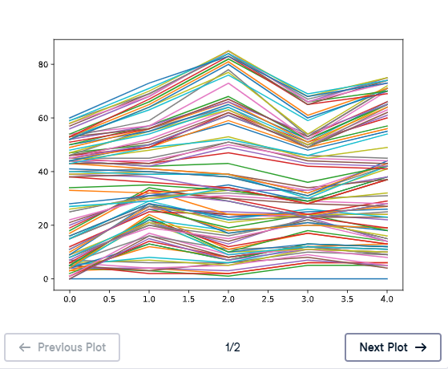
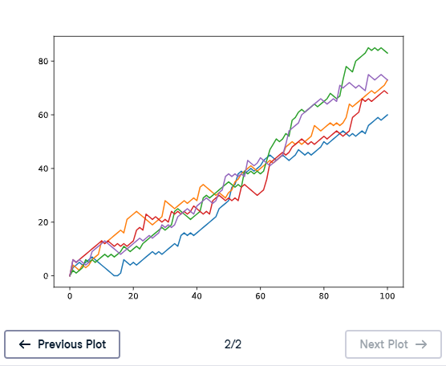

# 📈 Visualize All Walks

## 📌 Exercise Overview

`all_walks` is a **list of lists**, where every sub-list represents one complete random walk.

For example:

    all_walks = [
        random_walk_1,
        random_walk_2,
        random_walk_3,
        random_walk_4,
        random_walk_5
    ]

By converting `all_walks` to a NumPy array, we can use Matplotlib to visualize the random walks.

The nested `for` loop is already provided. The focus is on what happens **after** the random walks have been generated.

---

# 🧪 Exercise

Complete the following steps:

1. Convert `all_walks` into a NumPy array called `np_aw`.
2. Plot `np_aw` with `plt.plot()` and display it with `plt.show()`.
3. Clear the current figure using `plt.clf()`.
4. Transpose `np_aw` using `np.transpose()` and store the result as `np_aw_t`.
5. Plot `np_aw_t` and display it.
6. Compare the two plots.

---

# ✅ Solution

    # NumPy and Matplotlib imported, seed set.

    # Initialize and populate all_walks
    all_walks = []

    for i in range(5):
        random_walk = [0]

        for x in range(100):
            step = random_walk[-1]
            dice = np.random.randint(1, 7)

            if dice <= 2:
                step = max(0, step - 1)
            elif dice <= 5:
                step = step + 1
            else:
                step = step + np.random.randint(1, 7)

            random_walk.append(step)

        all_walks.append(random_walk)

    # Convert all_walks to NumPy array: np_aw
    np_aw = np.array(all_walks)

    # Plot np_aw and show
    plt.plot(np_aw)
    plt.show()

    # Clear the figure
    plt.clf()

    # Transpose np_aw: np_aw_t
    np_aw_t = np.transpose(np_aw)

    # Plot np_aw_t and show
    plt.plot(np_aw_t)
    plt.show()

---

# 1️⃣ Convert `all_walks` to a NumPy Array

Use:

    np_aw = np.array(all_walks)

This converts the list of five random walks into a **2D NumPy array**.

Each random walk starts at `0` and contains `100` additional positions, giving:

    101

values per walk.

With five random walks:

    np_aw.shape

returns:

    (5, 101)

### Meaning

- `5` rows → five random walks
- `101` columns → positions from the starting point through the 100th throw

---

# 2️⃣ Plot `np_aw`

Use:

    plt.plot(np_aw)
    plt.show()

### 📊 Output

### What Happens?

The plot is generated, but the orientation of the data is not the most intuitive way to represent the five random walks.

The array has shape:

    (5, 101)

so each row contains one complete random walk.

---

# 3️⃣ Clear the Current Figure

Before creating the next plot:

    plt.clf()

`plt.clf()` means:

> Clear the current figure.

This ensures the second plot is displayed separately rather than being drawn on top of the first plot.

---

# 4️⃣ Transpose `np_aw`

Use:

    np_aw_t = np.transpose(np_aw)

Transposing swaps the rows and columns.

Before:

    np_aw.shape
    (5, 101)

After:

    np_aw_t.shape
    (101, 5)

### Meaning

- `101` rows → one for each throw/position
- `5` columns → one for each random walk

---

# 🔄 Understanding the Transpose

Before transposing:

    np_aw =
    [
        walk 1
        walk 2
        walk 3
        walk 4
        walk 5
    ]

Each row represents one complete random walk.

After transposing:

    np_aw_t =
    [
        throw 0 → walk 1, walk 2, walk 3, walk 4, walk 5
        throw 1 → walk 1, walk 2, walk 3, walk 4, walk 5
        throw 2 → walk 1, walk 2, walk 3, walk 4, walk 5
        ...
    ]

Now each **column** represents one random walk.

---

# 5️⃣ Plot `np_aw_t`

Use:

    plt.plot(np_aw_t)
    plt.show()

### 📊 Output

The second plot is easier to interpret because each of the **five random walks** appears as a separate line across the throws.

---

# 📊 Shape Comparison

| Array | Shape | Rows | Columns |
|---|---|---:|---:|
| `np_aw` | `(5, 101)` | 5 walks | 101 positions |
| `np_aw_t` | `(101, 5)` | 101 positions | 5 walks |

The transpose changes:

    (5, 101)

into:

    (101, 5)

---

# 🧠 Why Does Transposing Help?

The goal is to visualize how each random walk changes over time.

After transposing:

    np_aw_t

has:

- One **column** for each random walk.
- One **row** for each throw/position.

When Matplotlib plots the columns of `np_aw_t`, each random walk appears as its own line.

This makes the graph much easier to interpret.

---

# 🔍 Understanding `np.transpose()`

`np.transpose()` swaps the dimensions of an array.

Example:

    array =
    [
        [1, 2, 3],
        [4, 5, 6]
    ]

The original shape is:

    (2, 3)

After:

    np.transpose(array)

the result is:

    [
        [1, 4],
        [2, 5],
        [3, 6]
    ]

The new shape is:

    (3, 2)

So:

> Rows become columns, and columns become rows.

---

# 📈 Why `plt.plot()` Works with a 2D Array

When given a 2D NumPy array, `plt.plot()` can plot multiple data series.

For:

    np_aw_t.shape
    (101, 5)

Matplotlib can treat the five columns as five separate series.

Therefore:

    plt.plot(np_aw_t)

produces five lines, one for each random walk.

---

# 🔄 Complete Workflow

    all_walks
        ↓
    np.array(all_walks)
        ↓
    np_aw
        ↓
    plt.plot(np_aw)
        ↓
    plt.show()
        ↓
    plt.clf()
        ↓
    np.transpose(np_aw)
        ↓
    np_aw_t
        ↓
    plt.plot(np_aw_t)
        ↓
    plt.show()

---

# 📚 Core Patterns

### Convert a list of lists to a NumPy array

    np_aw = np.array(all_walks)

### Check the shape

    np_aw.shape

### Transpose the array

    np_aw_t = np.transpose(np_aw)

### Plot a NumPy array

    plt.plot(np_aw_t)
    plt.show()

### Clear the figure

    plt.clf()

---

# 🧠 Key Concepts

## `all_walks`

A list containing multiple random walks.

## `np.array()`

Converts the list of lists into a NumPy array.

## `np_aw`

The original 2D NumPy array:

    (5, 101)

## `np.transpose()`

Swaps rows and columns.

## `np_aw_t`

The transposed array:

    (101, 5)

## `plt.plot()`

Plots the random walks as separate lines when working with the transposed 2D array.

---

# 🔑 Key Takeaways

- `all_walks` is a **list of lists**.
- Use:

      np_aw = np.array(all_walks)

  to convert it into a 2D NumPy array.
- The original array has shape:

      (5, 101)

- Use:

      np_aw_t = np.transpose(np_aw)

  to swap rows and columns.
- The transposed array has shape:

      (101, 5)

- After transposing, each column represents one random walk.
- `plt.plot(np_aw_t)` displays the five random walks as separate lines.
- `plt.clf()` clears the previous figure before creating the next graph.

### 🎯 Core Idea

> **Convert the list of random walks into a NumPy array, transpose it so each walk becomes a column, and plot it to visualize all walks clearly.**
