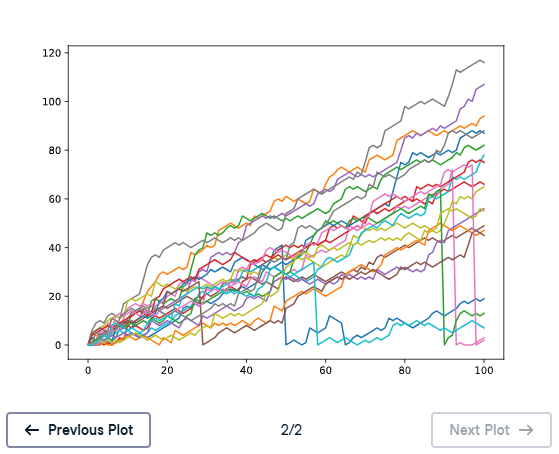

# 🤕 Implement Clumsiness

## 📌 Exercise Overview

The random walk simulation can be repeated as many times as needed by changing the `range()` in the top-level `for` loop.

However, there is one more rule to implement: you are **clumsy** and have a **0.5% chance of falling down** during each move.

If you fall:

```
step = 0
```

To simulate this, generate a random float between `0` and `1` using:

```
np.random.rand()
```

If the generated value is less than or equal to `0.005`, reset `step` to `0`.

---

# 🧪 Exercise

Complete the following:

1. Change the top-level `range()` so the random walk is simulated **20 times**.
2. Use `np.random.rand()` to implement the **0.5% chance of falling**.
3. If the random value is less than or equal to `0.005`, set `step` to `0`.
4. Plot the resulting random walks.

---

# ✅ Solution

```
# NumPy and Matplotlib imported, seed set

# Clear the plot so it doesn't get cluttered if you run this many times
plt.clf()

# Simulate random walk 20 times
all_walks = []

for i in range(20):
    random_walk = [0]

    for x in range(100):
        step = random_walk[-1]
        dice = np.random.randint(1, 7)

        if dice <= 2:
            step = max(0, step - 1)
        elif dice <= 5:
            step = step + 1
        else:
            step = step + np.random.randint(1, 7)

        # Implement clumsiness
        if np.random.rand() <= 0.005:
            step = 0

        random_walk.append(step)

    all_walks.append(random_walk)

# Create and plot np_aw_t
np_aw_t = np.transpose(np.array(all_walks))

plt.plot(np_aw_t)
plt.show()
```



---

# 🔍 Step-by-Step Explanation

## 1️⃣ Simulate 20 Random Walks

Change the outer loop from:

```
range(5)
```

to:

```
range(20)
```

So:

```
for i in range(20):
```

The simulation now creates **20 separate random walks**.

---

## 2️⃣ Generate a Random Float

Use:

```
np.random.rand()
```

This produces a random floating-point number between `0` and `1`.

For example:

```
0.347
0.812
0.004
0.971
```

---

## 3️⃣ Check the 0.5% Fall Probability

A probability of `0.5%` is equivalent to:

```
0.005
```

Therefore:

```
if np.random.rand() <= 0.005:
    step = 0
```

means:

> If the random number is `0.005` or lower, you fall and return to step `0`.

---

# 🎯 Why `0.005` Represents 0.5%

Convert the percentage to a decimal:

```
0.5 / 100 = 0.005
```

So:

```
0.005 = 0.5%
```

The random float is between `0` and `1`, allowing the comparison to represent this probability.

---

# 🧠 Complete Movement Logic

The simulation now has three possible dice outcomes plus the clumsiness rule.

### Dice `1` or `2`

```
step = max(0, step - 1)
```

Move down one step, but never below `0`.

### Dice `3`, `4`, or `5`

```
step = step + 1
```

Move up one step.

### Dice `6`

```
step = step + np.random.randint(1, 7)
```

Roll again and move up by the second roll.

### Clumsiness

After determining the new step:

```
if np.random.rand() <= 0.005:
    step = 0
```

There is a `0.5%` chance of falling and returning to the ground floor.

---

# 🔄 Execution Order

Each move follows this sequence:

```
Get previous step
      ↓
  Roll dice
      ↓
Update step
      ↓
Check clumsiness
      ↓
If fall → step = 0
      ↓
Append step
      ↓
Next iteration
```

The clumsiness check happens **after** the normal dice movement.

---

# 📊 Multiple Random Walks

With:

```
for i in range(20):
```

the program generates:

```
20
```

random walks.

Each walk contains:

```
101
```

positions:

* Initial position `0`
* `100` additional positions

The resulting array has shape:

```
(101, 20)
```

after:

```
np_aw_t = np.transpose(np.array(all_walks))
```

This gives one column per random walk.

---

# 📈 Visualizing the Result

The final plotting code is:

```
np_aw_t = np.transpose(np.array(all_walks))

plt.plot(np_aw_t)
plt.show()
```

Each line represents one of the 20 simulated random walks.

Because of the clumsiness rule, some walks may suddenly drop back to:

```
0
```

when a simulated fall occurs.

---

# 🔑 Key Takeaways

* Use `range(20)` to simulate **20 random walks**.

* `np.random.rand()` generates a random float between `0` and `1`.

* A `0.5%` probability is represented by:

  ```
  0.005
  ```

* The clumsiness rule is:

  ```
  if np.random.rand() <= 0.005:
      step = 0
  ```

* A fall resets the current position to `0`.

* The clumsiness check is performed after calculating the normal dice-based movement.

* `np.transpose()` organizes the random walks so they can be plotted as separate lines.

### 📚 Core Pattern

```
if np.random.rand() <= 0.005:
    step = 0
```

> 🎯 **Core idea:** Add a small random probability to the simulation to model falling, resetting the random walk to step `0`.
