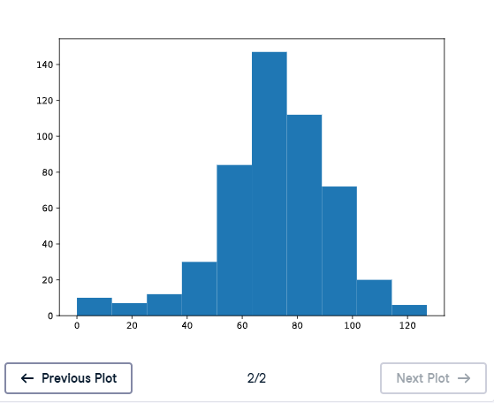

# 📊 Plot the Distribution

## 📌 Exercise Overview

The random-walk visualizations are useful, but the main question is still:

> **What are the odds that you'll reach 60 steps high on the Empire State Building?**

To estimate this, we need to look at the **final position** of every simulated random walk.

If we simulate the walk hundreds of times, each walk ends at a different step. These final positions form a **distribution**.

A histogram is a useful way to visualize this distribution.

---

# 🧪 Exercise

Complete the following:

1. Simulate the random walk **500 times**.
2. Use `np_aw_t` to select the **last row**, which contains the endpoint of all 500 random walks.
3. Store this NumPy array as `ends`.
4. Use `plt.hist()` to create a histogram of `ends`.
5. Use `plt.show()` to display the histogram.

> ⚠️ If your code takes too long to run, make sure you are plotting the final endpoints and not the entire random-walk array.

---

# ✅ Solution

    # NumPy and Matplotlib imported, seed set

    # Simulate random walk 500 times
    all_walks = []

    for i in range(500):
        random_walk = [0]

        for x in range(100):
            step = random_walk[-1]
            dice = np.random.randint(1, 7)

            if dice <= 2:
                step = max(0, step - 1)
            elif dice <= 5:
                step = step + 1
            else:
                step = step + np.random.randint(1, 7)

            if np.random.rand() <= 0.001:
                step = 0

            random_walk.append(step)

        all_walks.append(random_walk)

    # Create and transpose np_aw_t
    np_aw_t = np.transpose(np.array(all_walks))

    # Select last row from np_aw_t: ends
    ends = np_aw_t[-1, :]

    # Plot histogram of ends, display plot
    plt.hist(ends)
    plt.show()

---

# 1️⃣ Simulate 500 Random Walks

The outer loop is:

    for i in range(500):

This creates **500 separate random walks**.

Each random walk contains:

- The initial position `0`
- `100` additional positions

So each walk contains:

    101

values.

---

# 2️⃣ Build Each Random Walk

The movement rules remain the same.

### Dice `1` or `2`

    step = max(0, step - 1)

Move down one step, but never below `0`.

### Dice `3`, `4`, or `5`

    step = step + 1

Move up one step.

### Dice `6`

    step = step + np.random.randint(1, 7)

Roll the dice again and move up by the resulting number.

### Clumsiness

    if np.random.rand() <= 0.001:
        step = 0

This gives a `0.1%` chance of falling during each move in this exercise.

> 💡 `0.001 = 0.1%`. This exercise's supplied code uses `0.001`, even though the previous exercise used `0.005`.

---

# 3️⃣ Create `np_aw_t`

After all 500 walks have been generated:

    np_aw_t = np.transpose(np.array(all_walks))

First:

    np.array(all_walks)

converts the list of walks into a 2D NumPy array.

Then:

    np.transpose(...)

swaps the rows and columns.

The resulting shape is:

    (101, 500)

This means:

- `101` rows → positions from the starting point through the 100th throw
- `500` columns → one column for each random walk

---

# 4️⃣ Select the Endpoints

We are interested only in the **final position** of each walk.

Use:

    ends = np_aw_t[-1, :]

### Breaking It Down

#### `-1`

Selects the **last row**.

    np_aw_t[-1]

This is the position after the 100th throw.

#### `:`

Selects **all columns**.

    np_aw_t[-1, :]

So the expression means:

> Select the final position from every one of the 500 random walks.

---

# 📊 What Does `ends` Contain?

`ends` is a one-dimensional NumPy array containing:

    500

values.

Each value represents the final step of one random walk.

Conceptually:

    ends = [
        final_walk_1,
        final_walk_2,
        final_walk_3,
        ...
        final_walk_500
    ]

---

# 📈 Plot the Distribution

Use:

    plt.hist(ends)
    plt.show()

The histogram shows how frequently the different final positions occurred.

### Graph Output

---

# 🧠 Why Use the Last Row?

The random-walk array stores the **entire path** of every simulation.

For example:

    position 0
    position 1
    position 2
    ...
    position 100

But to estimate the chance of reaching the target, we only care about the **endpoint**.

Therefore:

    np_aw_t[-1, :]

extracts exactly the information we need.

---

# 🔍 Understanding the Data Shape

Before transposing:

    np.array(all_walks).shape

is:

    (500, 101)

Meaning:

- 500 walks
- 101 positions per walk

After transposing:

    np_aw_t.shape

is:

    (101, 500)

Meaning:

- 101 positions
- 500 walks

The final row:

    np_aw_t[-1, :]

contains:

    500 final positions

---

# 🎯 Connecting the Distribution to the Bet

The histogram of `ends` helps answer the original question:

> How often do the simulated walks finish at or above step `60`?

The distribution shows where the random walks tend to end.

To estimate the probability of reaching at least `60`, we can count how many endpoints satisfy:

    ends >= 60

and divide by the total number of simulations:

    number_of_successes / 500

This gives an empirical estimate of the probability.

---

# 🧠 Distribution Workflow

The complete process is:

    Simulate 500 random walks
             ↓
       Store in all_walks
             ↓
      Convert to NumPy array
             ↓
        Transpose array
             ↓
     Select the final row
             ↓
            ends
             ↓
       Plot histogram
             ↓
    Analyze final positions

---

# 📚 Important NumPy Concepts

## `np.array()`

Converts a list of lists into a NumPy array:

    np_aw = np.array(all_walks)

## `np.transpose()`

Swaps rows and columns:

    np_aw_t = np.transpose(np_aw)

## Negative Indexing

Selects the last row:

    np_aw_t[-1]

## Slicing

Selects all columns:

    np_aw_t[-1, :]

## Histogram

Visualizes the distribution:

    plt.hist(ends)

---

# 🔑 Key Takeaways

- Simulate many random walks to study their final positions.
- This exercise uses **500 simulations**.
- `np_aw_t[-1, :]` selects the endpoint of every random walk.
- `ends` therefore contains `500` final positions.
- A histogram of `ends` shows the **distribution of final steps**.
- The distribution can be used to estimate the probability of reaching a target such as step `60`.
- The supplied solution uses:

      np.random.rand() <= 0.001

  which represents a **0.1%** chance of falling per move.

### 📚 Core Pattern

    np_aw_t = np.transpose(np.array(all_walks))

    ends = np_aw_t[-1, :]

    plt.hist(ends)
    plt.show()

> 🎯 **Core idea:** To estimate the chances of winning the Empire State Building bet, simulate many walks, extract their final positions, and analyze the resulting distribution.
